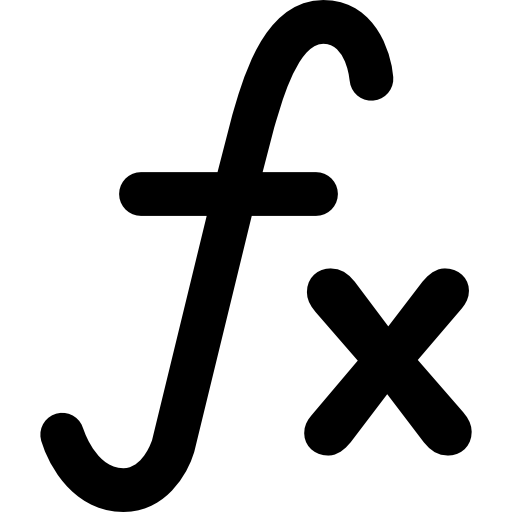

<h1>Meus Livros &#128218</h1>

Repositórios destinado a guardar meus livros que quero ler, estou lendo ou já li.

| Imagem                                                                                                                                                | Nome                                                                                                               | Área de Estudo | Estado  | Idioma    |
| ----------------------------------------------------------------------------------------------------------------------------------------------------- | ------------------------------------------------------------------------------------------------------------------ | -------------- | ------- | --------- |
| 

  | [Clean Code](https://github.com/GuiArmanLi/Leitura/Books/Programacao/clean_code.pdf)                               | Programação    | Doing 📖 | Inglês    |
| 

      | [Rest ao Microservices](https://github.com/GuiArmanLi/Leitura/Books/Programacao/rest_ao_microservices.pdf)         | Programação    | Done 📖  | Inglês    |
| 

    | [Aspectos Positivos Para o Emagrecimento](https://github.com/GuiArmanLi/Leitura/Books/Programacao/dialnet.pdf)     | Musculação     | Done 📖  | Português |
| 

    | [Individualidade Biológica](https://github.com/GuiArmanLi/Leitura/Books/Programacao/individualidade_biologica.pdf) | Musculação     | Done 📖  | Português |
| 

        | [Campbell Biology](https://github.com/GuiArmanLi/Leitura/Books/Biologia/Byology.pdf)                               | Biologia       | To Do 📖 | Inglês    |
| 

 | [Everything to Ace MAth](https://github.com/GuiArmanLi/Leitura/Books/Matematica/Math)                              | Matemática     | Done 📖  | Inglês    |
| 

 | [Basic Mathematics](https://github.com/GuiArmanLi/Leitura/Books/Matematica/basic_mathematics.pdf)                  | Matemática     | To Do 📖 | Inglês    |
| 

 | [How to Solve It](https://github.com/GuiArmanLi/Leitura/Books/Matematica/HowToSolveIt)                             | Matemática     | To Do 📖 | Inglês    |
